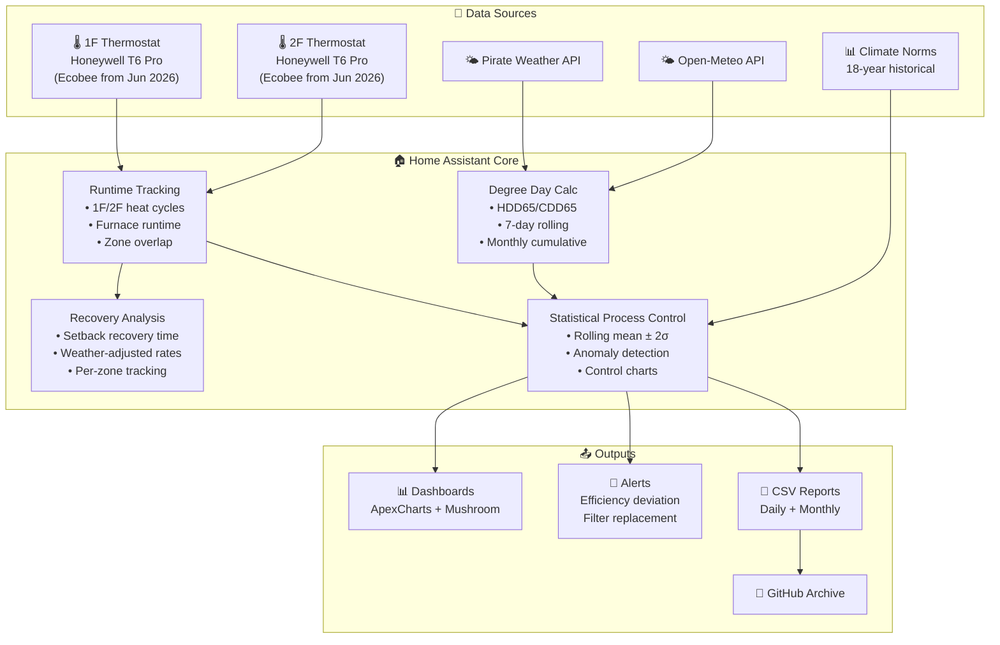
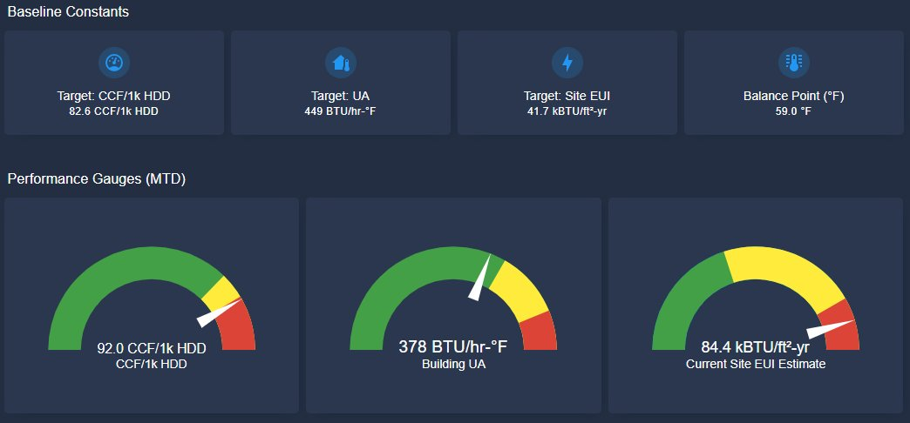
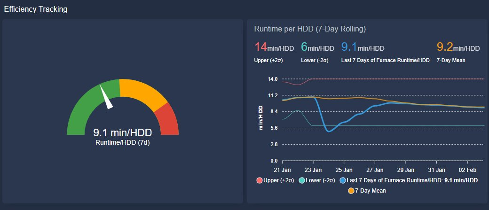
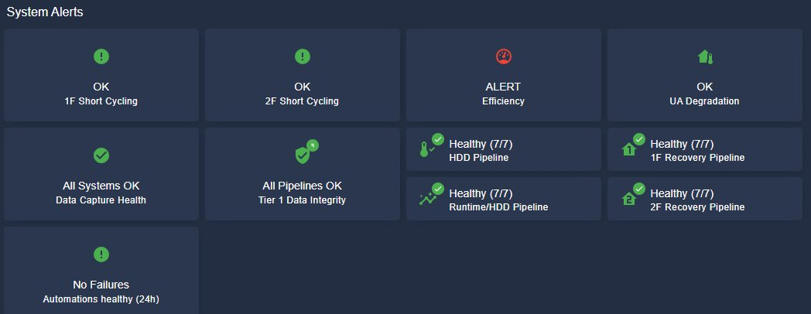

# Residential HVAC Performance Baseline

**A Five-Year Longitudinal Study of High-Efficiency Residential Energy Systems in Climate Zone 5A**

[](https://doi.org/10.5281/zenodo.18232616)
[](https://github.com/wkcollis1-eng/Residential-HVAC-Performance-Baseline-)
[](LICENSE)
[](https://www.home-assistant.io/)
[](https://basc.pnnl.gov/images/iecc-climate-zone-map)
[](data/)
[](https://github.com/sponsors/wkcollis1-eng)

## Overview

This repository documents a comprehensive energy performance baseline for a 2,440 sq. ft. high-efficiency residential structure in Central Connecticut (Climate Zone 5A). The analysis integrates **54 months** of verified utility data (January 2022 - June 2026), high-resolution HVAC runtime telemetry, and independent domestic hot water monitoring to establish diagnostic performance thresholds.

<!-- METRICS_START -->
**Key Findings (Updated June 2026):**
- **Site EUI (12-mo rolling):** 41.8 kBTU/ft²-yr (Jul 2025–Jun 2026; ~33% better than regional average)
- **Baseline Site EUI:** 41.7 kBTU/ft²-yr — current +0.2% (back to baseline as the cold winter rolls off)
- **Heating Intensity:** 90.3 CCF/1k HDD (annual baseline, corrected with Navien DHW metering)
- **Envelope UA:** 480 BTU/hr-°F (21-34% superior to 2021 IECC code-minimum; rolling recompute pending daily temps past Feb 2026)
- **12-mo Electricity:** 6,468 kWh (65% below average for home size)
- **DHW Optimization:** −33.9% H1 2026 YoY from recirculation schedule change (~$68 saved in H1, ahead of the ~$77/year projection)
<!-- METRICS_END -->

<!-- HIGHLIGHTS_START -->
## 🆕 H1 2026 Update Highlights (January–June)

The first half of 2026 ran **12% colder** than 2025 (3,782 vs 3,371 HDD, BDL), yet total gas held essentially flat and the electric bill fell 22% — the DHW recirculation program offsetting the weather-driven heating increase.

| Metric | H1 2025 | H1 2026 | YoY Change | Status |
|--------|---------|---------|------------|--------|
| Weather Severity (HDD65, BDL) | 3,371 | 3,782 | +12.2% | ⚠️ Colder |
| Total Gas | 557 CCF | 569 CCF | +2.2% | ✅ Flat on colder weather |
| Gas Cost | $951.68 | $978.69 | +2.8% | ✅ Flat (rate +0.7%) |
| Space Heating | 437 CCF | 483 CCF | +10.5% | ✅ Tracks weather (< HDD) |
| DHW (Navien) | 120.0 CCF | 79.3 CCF | **−33.9%** | ✅ Recirc program |
| Heating Intensity (net, BDL) | 129.6 | 127.7 CCF/1k HDD | −1.5% | ✅ Held |
| Electricity | 2,656 kWh | 2,394 kWh | −9.9% | ✅ Lower use |
| Electric Cost | $814.69 | $633.75 | **−22.2%** | ✅ Use + −14% rate |

**Key Insights:**
1. **Gas flat on a 12% colder half:** space heating rose +10.5% (weather), but −34% DHW nearly offset it, so total gas moved just +2.2%.
2. **Heating efficiency held:** net intensity −1.5% (129.6 → 127.7 CCF/1k HDD); runtime rose +6.7%, below the +12.2% HDD.
3. **Electric bill down 22%:** −9.9% usage compounded with a −13.7% effective-rate decline; gas had no such rate tailwind (+0.7%/CCF).
4. **Vacation included:** each half-year carries the household's recurring 1–2 week winter vacation (Feb 2025 / Mar 2026), so the aggregate is apples-to-apples.

### DHW Recirculation Optimization (H1 2026 Results)

The recirculation-schedule reduction (recirc hours cut to ~30 h/mo by June; ~15 hr/day schedule, off 9 PM–6 AM) is the dominant efficiency lever of the half-year — and the reason total gas stayed flat on a much colder heating season.

- **H1 DHW savings:** 40.7 CCF (120.0 → 79.3 CCF, **−33.9% YoY**) — ~$68 in gas cost (−30.3%), already tracking above the original ~$77/year projection
- **Recirc hours:** −33% H1 (344 → 229 h)
- **Share of gas story:** DHW accounts for ~77% of the offset against the +46 CCF weather-driven heating increase
- **Comfort:** no issues reported

See [UPDATES.md](UPDATES.md) for complete monthly analysis.
<!-- HIGHLIGHTS_END -->

## 🏗️ System Architecture


```mermaid
flowchart TB
    subgraph inputs["📡 Data Sources"]
        T1["🌡️ 1F Thermostat<br/>Honeywell T6 Pro<br/>(Ecobee from Jun 2026)"]
        T2["🌡️ 2F Thermostat<br/>Honeywell T6 Pro<br/>(Ecobee from Jun 2026)"]
        PW["🌤️ Pirate Weather API"]
        OM["🌤️ Open-Meteo API"]
        CN["📊 Climate Norms<br/>18-year historical"]
    end

    subgraph ha["🏠 Home Assistant Core"]
        direction TB
        RT["Runtime Tracking<br/>• 1F/2F heat cycles<br/>• Furnace runtime<br/>• Zone overlap"]
        DD["Degree Day Calc<br/>• HDD65/CDD65<br/>• 7-day rolling<br/>• Monthly cumulative"]
        SPC["Statistical Process Control<br/>• Rolling mean ± 2σ<br/>• Anomaly detection<br/>• Control charts"]
        REC["Recovery Analysis<br/>• Setback recovery time<br/>• Weather-adjusted rates<br/>• Per-zone tracking"]
    end

    subgraph outputs["📤 Outputs"]
        CSV["📝 CSV Reports<br/>Daily + Monthly"]
        ALERT["🚨 Alerts<br/>Efficiency deviation<br/>Filter replacement"]
        DASH["📊 Dashboards<br/>ApexCharts + Mushroom"]
        GH["🐙 GitHub Archive"]
    end

    T1 --> RT
    T2 --> RT
    PW --> DD
    OM --> DD
    CN --> SPC
    RT --> SPC
    DD --> SPC
    RT --> REC

    SPC --> CSV
    SPC --> ALERT
    SPC --> DASH
    CSV --> GH
```

## 🎯 What Makes This Different

| Traditional Monitoring | This Approach |
|------------------------|---------------|
| "Your furnace ran 4 hours today" | "Your furnace ran 12% more than expected for today's weather" |
| Static efficiency thresholds | Rolling ±2σ control limits that adapt to your home |
| Single-zone analysis | **Chaining Index** quantifies multi-zone coordination |
| Compare to yesterday | Compare to 18-year climate normals for this date |
| Equipment-focused | **Post-Program Efficiency** framework for already-efficient homes |

## 📊 Five-Year Performance Summary

| Metric | 2022 | 2023 | 2024 | 2025 | 2026 YTD |
|--------|------|------|------|------|----------|
| Annual Gas (CCF) | 815 | 764 | 694 | 787 | 569* |
| Annual Elec (kWh) | 6,824 | 6,591 | 6,543 | 6,730 | 2,394* |
| Heating Intensity | 89.8 | 90.8 | 80.3 | 95.5 | 127.7* |
| Site EUI | 42.1 | 40.8 | 38.2 | 41.7 | — |

*Jan-Jun 2026 only (partial year; H1 intensity is winter-weighted and not comparable to the annual figures)

### Statistical Stability (4-Year Baseline)

| Metric | Mean | Std Dev | CV (%) | Status |
|--------|------|---------|--------|--------|
| Heating Intensity (CCF/1k HDD) | 89.1 | 6.2 | 7.0% | ✅ Excellent |
| Site EUI (kBTU/ft²-yr) | 40.8 | 2.1 | 5.1% | ✅ Excellent |
| Electricity Baseload | 9.6 kWh/day | 0.3 | 3.1% | ✅ Exceptional |

## 🚀 Quick Start (Home Assistant Users)

For the full Home Assistant configuration that powers the sensors, dashboards, and automation used to generate this dataset, see the companion repo: [wkcollis1-eng/home-assistant-config](https://github.com/wkcollis1-eng/home-assistant-config).

### Option 1: Full Package (Recommended)

```bash
curl -o /config/packages/hvac_baseline.yaml \
  https://raw.githubusercontent.com/wkcollis1-eng/Residential-HVAC-Performance-Baseline-/main/homeassistant/packages/hvac_baseline.yaml
```

### Option 2: Core Sensor (5 minutes)

The single most useful efficiency metric:
<!--  -->
```yaml
template:
  - sensor:
      - name: "HVAC Runtime per HDD Today"
        unique_id: hvac_runtime_per_hdd_today
        unit_of_measurement: "min/HDD"
        state: >
          
          
          
          {{ ((runtime_hours * 60) / hdd) | round(1) if hdd > 0 else 0 }}
```
<!--  -->
## 📁 Repository Structure

```
├── README.md                     # This file
├── BASELINE_REPORT.md            # Complete technical analysis (17,000+ words)
├── UPDATES.md                    # 🆕 Monthly update log (all months, newest-first)
├── DATA_SUMMARY.md               # Quick-reference metrics and tables
├── METHODOLOGY.md                # Billing-aligned calculation methodology
├── SYSTEM_SPECIFICATIONS.md      # Equipment technical specifications
├── REALTIME_MONITORING_2026.md   # Home Assistant implementation details
├── scripts/
│   └── validate_month.py         # 🆕 Pre-commit validation (V-HVAC-1 through V-HVAC-8)
├── homeassistant/                # Home Assistant configuration
│   ├── packages/
│   │   └── hvac_baseline.yaml
│   └── dashboards/
└── data/                         # Raw operational datasets
    ├── monthly_summary.csv       # 🆕 Derived monthly metrics (all-in-one) — through Jun 2026
    ├── daily_temperature.csv     # Updated through Feb 2026
    ├── monthly_hvac_runtime.csv  # Updated through Feb 2026
    ├── monthly_dhw_navien.csv    # Updated through Mar 2026
    ├── monthly_electricity_eversource.csv   # Updated through Mar 2026
    └── monthly_gas_scg.csv                   # Updated through Mar 2026
```

## 🏠 Property Context

| Attribute | Specification |
|-----------|---------------|
| Location | Central Connecticut, Climate Zone 5A |
| Construction | 2021, Two-story Colonial |
| Conditioned Area | 2,440 sq. ft. |
| Occupancy | 2 residents |
| Primary Heating | American Standard Silver 95 (96% AFUE) condensing gas furnace |
| Primary Cooling | American Standard Silver 14 (4-ton, 14 SEER) split system |
| Zoning | 2-zone (1F/2F); Honeywell T6 Pro thermostats (through May 2026), Ecobee Smart Enhanced from June 2026 |
| Moisture Control | Santa Fe Classic dehumidifier (110 PPD, 700W) |
| DHW | Navien NPE-series condensing tankless |

## 📈 Investigation Thresholds (2026)

| Metric | Baseline | Warning (+10%) | Action (+15%) |
|--------|----------|----------------|---------------|
| Heating Intensity | 90.3 CCF/1k HDD | >99 | >104 |
| Runtime Efficiency | 10.9 min/HDD | >12.0 | >12.5 |
| Monthly Space Heat (Jan) | 138 CCF | >152 | >159 |
| Monthly DHW (Jan) | 22.8 CCF | >25.1 | >26.2 |
| Zone Imbalance | 50% ±5% | <42% or >58% | <38% or >62% |


## Live Monitoring Implementation

The baseline analysis feeds into a real-time Home Assistant monitoring system that tracks performance against established thresholds using Statistical Process Control (SPC). This implementation demonstrates how the calculated baselines translate into operational anomaly detection.

### Dashboard Overview

The monitoring system provides continuous validation of system performance:


*Real-time performance tracking against baseline targets with color-coded status indicators*


*Statistical Process Control monitoring showing 7-day rolling means and ±2σ bounds derived from baseline analysis*


*Automated health checks ensuring data capture integrity and alerting on efficiency degradation*

### Key Monitoring Features

* **HDD/CDD Tracking** - Heating/cooling degree days with 7-day rolling averages
* **Efficiency Monitoring** - Runtime per HDD with auto-calculated ±2σ statistical bounds
* **Recovery Rate Analysis** - Setback recovery tracking with weather adjustment
* **Zone Balance Analysis** - 1F/2F runtime distribution and cycle overlap detection
* **Filter Tracking** - Runtime-based maintenance alerts
* **Anomaly Detection** - Automated alerts when performance drifts beyond baseline thresholds

**Full monitoring configuration and implementation details:**
📂 [home-assistant-config](https://github.com/wkcollis1-eng/home-assistant-config)

For additional dashboard views and implementation notes, see [DASHBOARD_EXAMPLES.md](./DASHBOARD_EXAMPLES.md).

---

## ⚠️ Why Standard Utility Programs Don't Apply

This home's exceptional performance (41.7 kBTU/ft²-yr EUI, 33% better than regional average) places it **beyond the design envelope** of traditional utility efficiency programs.

**Key Finding:** Standard interventions (insulation upgrades, equipment replacement) would yield <5% additional savings at costs exceeding 20-year payback periods.

See [UTILITY_PROGRAM_ANALYSIS.md](UTILITY_PROGRAM_ANALYSIS.md) for detailed analysis.

## 📬 Recent Updates

### v1.6.0 (July 2026)
- Added March–June 2026 data; H1 2026 vs 2025 half-year analysis
- Extended dataset to 54 months
- Gas flat (+2.2%) and −34% DHW on a 12% colder H1; electric bill −22.2%; heating intensity held (−1.5%)
- Thermostats transitioned Honeywell T6 Pro → Ecobee Smart Enhanced (June 2026)
- Corrected `monthly_summary.csv` cost/DHW cells (Feb/Mar 2026) from HA archives
- *(April–May 2026 monthly updates logged in [UPDATES.md](UPDATES.md))*

### v1.4.0 (March 2026)
- Added February 2026 data and analysis
- Extended dataset to 50 months
- DHW optimization savings sustained at -22% YoY
- Runtime efficiency: 8.8 min/HDD (19% better than baseline)
- 2025-2026 heating season cumulative: 720 hrs / 4,529 HDD

### v1.3.2 (February 2026)
- Added January 2026 data and analysis
- Extended dataset to 49 months
- Validated baseline under extreme cold conditions (1,230 HDD)
- Real-time monitoring integration documented

### v1.2.1 (January 2026)
- Fully billing-aligned methodology implementation
- Four-year statistical validation complete
- Home Assistant real-time monitoring system deployed

## 📚 Citation

```bibtex
@misc{collis2026hvac,
  author = {Collis, William K.},
  title = {Residential HVAC Performance Baseline: A Five-Year Longitudinal Study in Climate Zone 5A},
  year = {2026},
  publisher = {GitHub},
  url = {https://github.com/wkcollis1-eng/Residential-HVAC-Performance-Baseline-},
  doi = {10.5281/zenodo.18232616}
}
```

## 🤝 Contributing

Contributions welcome! Particularly interested in:
- Comparative datasets from other climate zones
- Alternative SPC methodologies
- Dashboard improvements
- Multi-fuel system adaptations

See [CONTRIBUTING.md](CONTRIBUTING.md) for guidelines.

## 📬 Contact

- **GitHub Issues:** [Open an issue](https://github.com/wkcollis1-eng/Residential-HVAC-Performance-Baseline-/issues)
- **Repository Owner:** [@wkcollis1-eng](https://github.com/wkcollis1-eng)

## 💝 Support This Project

[](https://github.com/sponsors/wkcollis1-eng)

If this five-year baseline is useful for your own energy monitoring work, consider sponsoring continued data collection.

---

**Version:** 1.6.0 (July 2026)
**Status:** Active Baseline — 54 months of validated data
**Next Update:** July 2026 monthly + H2 mid-year review
