# Residential HVAC Performance Baseline

**A Five-Year Longitudinal Study of High-Efficiency Residential Energy Systems in Climate Zone 5A**

[](https://doi.org/10.5281/zenodo.18232616)
[](https://github.com/wkcollis1-eng/Residential-HVAC-Performance-Baseline-)
[](LICENSE)
[](https://www.home-assistant.io/)
[](https://basc.pnnl.gov/images/iecc-climate-zone-map)
[](data/)

## Overview

This repository documents a comprehensive energy performance baseline for a 2,440 sq. ft. high-efficiency residential structure in Central Connecticut (Climate Zone 5A). The analysis integrates **49 months** of verified utility data (January 2022 - January 2026), high-resolution HVAC runtime telemetry, and independent domestic hot water monitoring to establish diagnostic performance thresholds.

**Key Findings (Updated January 2026):**
- **Site EUI:** 41.7 kBTU/ft²-yr (33% better than regional average)
- **Heating Intensity:** 90.3 CCF/1k HDD (corrected with Navien DHW metering)
- **Envelope UA:** 480 BTU/hr-°F (21-34% superior to 2021 IECC code-minimum)
- **Annual Electricity:** 6,730 kWh (65% below average for home size)
- **DHW Optimization:** -22% from recirculation schedule change (~$77/year savings)
- **January 2026 Validation:** System performed within baseline during extreme cold (1,230 HDD)

## 🆕 January 2026 Update Highlights

The January 2026 cold snap (including -2°F minimum on Jan 31) provided the most rigorous test of system performance in the 5-year dataset:

| Metric | Jan 2025 | Jan 2026 | YoY Change | Status |
|--------|----------|----------|------------|--------|
| Total Gas | 161 CCF | 168 CCF | +4.3% | ✅ |
| Space Heating | 138.2 CCF | 150.2 CCF | +8.7% | ✅ Tracks weather |
| DHW (Navien) | 22.8 CCF | 17.8 CCF | **-22.2%** | ✅ Optimized |
| Weather Severity | 1,134 HDD | 1,230 HDD | +8.5% | ⚠️ Colder |
| Heating Efficiency | 121.8 CCF/1kHDD | 122.1 CCF/1kHDD | **+0.2%** | ✅ Flat |
| HVAC Runtime | — | 220 hrs (10.7 min/HDD) | — | ✅ Baseline |

**Key Insights:**
1. **Space heating tracked weather perfectly:** +8.7% gas vs +8.5% HDD — essentially 1:1
2. **Heating intensity flat YoY:** +0.2% variance (well within 7% CV baseline)
3. **DHW optimization success:** Recirculation schedule change (24hr→15hr) saved 22%

### DHW Recirculation Optimization

**Finding:** 59% of DHW gas was going to recirculation standby losses (vs 23% factory estimate)  
**Action:** Reduced recirc schedule from 24 hr/day to 15 hr/day (off 9 PM - 6 AM)  
**Projected Savings:** ~$77/year with zero hardware cost

See [JANUARY_2026_UPDATE.md](JANUARY_2026_UPDATE.md) for complete analysis.

## 🏗️ System Architecture

```mermaid
flowchart TB
    subgraph inputs["📡 Data Sources"]
        T1["🌡️ 1F Thermostat<br/>Honeywell T6 Pro"]
        T2["🌡️ 2F Thermostat<br/>Honeywell T6 Pro"]
        PW["🌤️ Pirate Weather API"]
        OM["🌤️ Open-Meteo API"]
        CN["📊 Climate Norms<br/>18-year historical"]
    end

    subgraph ha["🏠 Home Assistant Core"]
        direction TB
        RT["Runtime Tracking<br/>• 1F/2F heat cycles<br/>• Furnace runtime<br/>• Zone overlap"]
        DD["Degree Day Calc<br/>• HDD65/CDD65<br/>• 7-day rolling<br/>• Monthly cumulative"]
        SPC["Statistical Process Control<br/>• Rolling mean ± 2σ<br/>• Anomaly detection<br/>• Control charts"]
        REC["Recovery Analysis<br/>• Setback recovery time<br/>• Weather-adjusted rates<br/>• Per-zone tracking"]
    end

    subgraph outputs["📤 Outputs"]
        CSV["📁 CSV Reports<br/>Daily + Monthly"]
        ALERT["🚨 Alerts<br/>Efficiency deviation<br/>Filter replacement"]
        DASH["📊 Dashboards<br/>ApexCharts + Mushroom"]
        GH["🐙 GitHub Archive"]
    end

    T1 --> RT
    T2 --> RT
    PW --> DD
    OM --> DD
    CN --> SPC
    RT --> SPC
    DD --> SPC
    RT --> REC
    
    SPC --> CSV
    SPC --> ALERT
    SPC --> DASH
    CSV --> GH
```



## 🎯 What Makes This Different

| Traditional Monitoring | This Approach |
|------------------------|---------------|
| "Your furnace ran 4 hours today" | "Your furnace ran 12% more than expected for today's weather" |
| Static efficiency thresholds | Rolling ±2σ control limits that adapt to your home |
| Single-zone analysis | **Chaining Index** quantifies multi-zone coordination |
| Compare to yesterday | Compare to 18-year climate normals for this date |
| Equipment-focused | **Post-Program Efficiency** framework for already-efficient homes |

## 📊 Five-Year Performance Summary

| Metric | 2022 | 2023 | 2024 | 2025 | Jan 2026 |
|--------|------|------|------|------|----------|
| Annual Gas (CCF) | 815 | 764 | 694 | 787 | 168* |
| Annual Elec (kWh) | 6,824 | 6,591 | 6,543 | 6,730 | 515* |
| Heating Intensity | 89.8 | 90.8 | 80.3 | 95.5 | 123.6* |
| Site EUI | 42.1 | 40.8 | 38.2 | 41.7 | — |

*January 2026 only (partial year)

### Statistical Stability (4-Year Baseline)

| Metric | Mean | Std Dev | CV (%) | Status |
|--------|------|---------|--------|--------|
| Heating Intensity (CCF/1k HDD) | 89.1 | 6.2 | 7.0% | ✅ Excellent |
| Site EUI (kBTU/ft²-yr) | 40.8 | 2.1 | 5.1% | ✅ Excellent |
| Electricity Baseload | 9.6 kWh/day | 0.3 | 3.1% | ✅ Exceptional |

## 🚀 Quick Start (Home Assistant Users)

For the full Home Assistant configuration that powers the sensors, dashboards, and automation used to generate this dataset, see the companion repo: [wkcollis1-eng/home-assistant-config](https://github.com/wkcollis1-eng/home-assistant-config).

### Option 1: Full Package (Recommended)

```bash
curl -o /config/packages/hvac_baseline.yaml \
  https://raw.githubusercontent.com/wkcollis1-eng/Residential-HVAC-Performance-Baseline-/main/homeassistant/packages/hvac_baseline.yaml
```

### Option 2: Core Sensor (5 minutes)

The single most useful efficiency metric:

```yaml
template:
  - sensor:
      - name: "HVAC Runtime per HDD Today"
        unique_id: hvac_runtime_per_hdd_today
        unit_of_measurement: "min/HDD"
        state: >
          
          
          
          {{ ((runtime_hours * 60) / hdd) | round(1) if hdd > 0 else 0 }}
```

## 📁 Repository Structure

```
├── README.md                     # This file
├── BASELINE_REPORT.md            # Complete technical analysis (17,000+ words)
├── DATA_SUMMARY.md               # Quick-reference metrics and tables
├── METHODOLOGY.md                # Billing-aligned calculation methodology
├── SYSTEM_SPECIFICATIONS.md      # Equipment technical specifications
├── JANUARY_2026_UPDATE.md        # 🆕 January 2026 performance analysis
├── REALTIME_MONITORING_2026.md   # Home Assistant implementation details
├── homeassistant/                # Home Assistant configuration
│   ├── packages/
│   │   └── hvac_baseline.yaml
│   └── dashboards/
└── data/                         # Raw operational datasets
    ├── daily_temperature.csv     # 🆕 Updated through Jan 2026
    ├── monthly_hvac_runtime.csv  # 🆕 Updated through Jan 2026
    ├── monthly_dhw_navien.csv    # 🆕 Updated through Jan 2026
    ├── monthly_electricity_eversource.csv
    └── monthly_gas_scg.csv       # 🆕 Updated through Jan 2026
```

## 🏠 Property Context

| Attribute | Specification |
|-----------|---------------|
| Location | Central Connecticut, Climate Zone 5A |
| Construction | 2021, Two-story Colonial |
| Conditioned Area | 2,440 sq. ft. |
| Occupancy | 2 residents |
| Primary Heating | American Standard Silver 95 (96% AFUE) condensing gas furnace |
| Primary Cooling | American Standard Silver 14 (4-ton, 14 SEER) split system |
| Zoning | 2-zone (1F/2F) with Honeywell T6 Pro thermostats |
| Moisture Control | Santa Fe Classic dehumidifier (110 PPD, 700W) |
| DHW | Navien NPE-series condensing tankless |

## 📈 Investigation Thresholds (2026)

| Metric | Baseline | Warning (+10%) | Action (+15%) |
|--------|----------|----------------|---------------|
| Heating Intensity | 90.3 CCF/1k HDD | >99 | >104 |
| Runtime Efficiency | 10.9 min/HDD | >12.0 | >12.5 |
| Monthly Space Heat (Jan) | 138 CCF | >152 | >159 |
| Monthly DHW (Jan) | 22.8 CCF | >25.1 | >26.2 |
| Zone Imbalance | 50% ±5% | <42% or >58% | <38% or >62% |

## ⚠️ Why Standard Utility Programs Don't Apply

This home's exceptional performance (41.7 kBTU/ft²-yr EUI, 33% better than regional average) places it **beyond the design envelope** of traditional utility efficiency programs.

**Key Finding:** Standard interventions (insulation upgrades, equipment replacement) would yield <5% additional savings at costs exceeding 20-year payback periods.

See [UTILITY_PROGRAM_ANALYSIS.md](UTILITY_PROGRAM_ANALYSIS.md) for detailed analysis.

## 📬 Recent Updates

### v1.3.2 (February 2026)
- Added January 2026 data and analysis
- Extended dataset to 49 months
- Validated baseline under extreme cold conditions (1,230 HDD)
- Confirmed -3.3% YoY efficiency improvement despite 8.4% colder weather
- Real-time monitoring integration documented

### v1.2.1 (January 2026)
- Fully billing-aligned methodology implementation
- Four-year statistical validation complete
- Home Assistant real-time monitoring system deployed

## 📚 Citation

```bibtex
@misc{collis2026hvac,
  author = {Collis, William K.},
  title = {Residential HVAC Performance Baseline: A Five-Year Longitudinal Study in Climate Zone 5A},
  year = {2026},
  publisher = {GitHub},
  url = {https://github.com/wkcollis1-eng/Residential-HVAC-Performance-Baseline-},
  doi = {10.5281/zenodo.18232616}
}
```

## 🤝 Contributing

Contributions welcome! Particularly interested in:
- Comparative datasets from other climate zones
- Alternative SPC methodologies
- Dashboard improvements
- Multi-fuel system adaptations

See [CONTRIBUTING.md](CONTRIBUTING.md) for guidelines.

## 📬 Contact

- **GitHub Issues:** [Open an issue](https://github.com/wkcollis1-eng/Residential-HVAC-Performance-Baseline-/issues)
- **Repository Owner:** [@wkcollis1-eng](https://github.com/wkcollis1-eng)

---

**Version:** 1.3.2 (February 2026)  
**Status:** Active Baseline — 49 months of validated data  
**Next Update:** March 2026 (post-winter season summary)
