# Residential HVAC Performance Baseline

**A Four-Year Longitudinal Study of High-Efficiency Residential Energy Systems in Climate Zone 5A**

[](https://doi.org/10.5281/zenodo.18232616)
[](https://github.com/wkcollis1-eng/Residential-HVAC-Performance-Baseline-)
[](LICENSE)
[](https://www.home-assistant.io/)
[](https://basc.pnnl.gov/images/iecc-climate-zone-map)
[](data/)

## Overview

This repository documents a comprehensive energy performance baseline for a 2,440 sq. ft. high-efficiency residential structure in Central Connecticut (Climate Zone 5A). The analysis integrates four years of verified utility data (2022-2025), high-resolution HVAC runtime telemetry, and independent domestic hot water monitoring to establish diagnostic performance thresholds.

**Key Findings:**
- **Site EUI:** 41.7 kBTU/ft²-yr (33% better than regional average)
- **Heating Intensity:** 95.5 CCF/1k HDD (CV: 7.0% over 4 years)
- **Envelope UA:** 480 BTU/hr-°F (21-34% superior to 2021 IECC code-minimum)
- **Annual Electricity:** 6,730 kWh (65% below average for home size)

## 🏗️ System Architecture

```mermaid
flowchart TB
    subgraph inputs["📡 Data Sources"]
        T1["🌡️ 1F Thermostat<br/>Honeywell T6 Pro"]
        T2["🌡️ 2F Thermostat<br/>Honeywell T6 Pro"]
        PW["🌤️ Pirate Weather API"]
        OM["🌤️ Open-Meteo API"]
        CN["📊 Climate Norms<br/>18-year historical"]
    end

    subgraph ha["🏠 Home Assistant Core"]
        direction TB
        RT["Runtime Tracking<br/>• 1F/2F heat cycles<br/>• Furnace runtime<br/>• Zone overlap"]
        DD["Degree Day Calc<br/>• HDD65/CDD65<br/>• 7-day rolling<br/>• Monthly cumulative"]
        SPC["Statistical Process Control<br/>• Rolling mean ± 2σ<br/>• Anomaly detection<br/>• Control charts"]
        REC["Recovery Analysis<br/>• Setback recovery time<br/>• Weather-adjusted rates<br/>• Per-zone tracking"]
    end

    subgraph outputs["📤 Outputs"]
        CSV["📁 CSV Reports<br/>Daily + Monthly"]
        ALERT["🚨 Alerts<br/>Efficiency deviation<br/>Filter replacement"]
        DASH["📊 Dashboards<br/>ApexCharts + Mushroom"]
        GH["🐙 GitHub Archive"]
    end

    T1 --> RT
    T2 --> RT
    PW --> DD
    OM --> DD
    CN --> SPC
    RT --> SPC
    DD --> SPC
    RT --> REC
    
    SPC --> CSV
    SPC --> ALERT
    SPC --> DASH
    CSV --> GH
```



## 🎯 What Makes This Different

| Traditional Monitoring | This Approach |
|------------------------|---------------|
| "Your furnace ran 4 hours today" | "Your furnace ran 12% more than expected for today's weather" |
| Static efficiency thresholds | Rolling ±2σ control limits that adapt to your home |
| Single-zone analysis | **Chaining Index** quantifies multi-zone coordination |
| Compare to yesterday | Compare to 18-year climate normals for this date |
| Equipment-focused | **Post-Program Efficiency** framework for already-efficient homes |

## 🚀 Quick Start (Home Assistant Users)

Want to add these metrics to your own Home Assistant setup? Start with these high-value sensors:

### Option 1: Full Package (Recommended)

Drop the single-file package into your Home Assistant:

```bash
# Download the package
curl -o /config/packages/hvac_baseline.yaml \
  https://raw.githubusercontent.com/wkcollis1-eng/Residential-HVAC-Performance-Baseline-/main/homeassistant/packages/hvac_baseline.yaml

# Add to configuration.yaml (if not already using packages)
# homeassistant:
#   packages: !include_dir_named packages
```

Then restart Home Assistant. See [`homeassistant/README.md`](homeassistant/README.md) for customization.

### Option 2: Individual Sensors

#### Runtime per HDD (5 minutes)
The single most useful efficiency metric. Add to your `configuration.yaml`:

```yaml
template:
  - sensor:
      - name: "HVAC Runtime per HDD Today"
        unique_id: hvac_runtime_per_hdd_today
        unit_of_measurement: "min/HDD"
        state: >
          
          
          
          {{ ((runtime_hours * 60) / hdd) | round(1) if hdd > 0 else 0 }}
```

**Interpretation:** A consistent value (±15%) indicates stable efficiency. Sudden increases suggest filter issues, duct problems, or envelope changes.

#### Zone Balance Alert (10 minutes)
For multi-zone systems—know when zones are fighting each other:

```yaml
template:
  - sensor:
      - name: "HVAC Zone Balance Ratio"
        unique_id: hvac_zone_balance_ratio
        unit_of_measurement: "%"
        state: >
          
          
          
          {{ ((z2 / total) * 100) | round(1) if total > 0 else 50 }}
          
  - binary_sensor:
      - name: "HVAC Zone Imbalance Alert"
        state: >
          
          {{ ratio < 35 or ratio > 65 }}
```

#### Chaining Index (Novel Metric)
Measures how often zone calls overlap into single furnace cycles:

```yaml
template:
  - sensor:
      - name: "HVAC Chaining Index"
        unique_id: hvac_chaining_index
        icon: mdi:link-variant
        state: >
          
          
          {{ (zone_calls / furnace_cycles) | round(2) if furnace_cycles > 0 else 1.0 }}
```

**Interpretation:** 
- **1.0** = No overlap (zones never call together)
- **1.5** = Moderate coordination (some back-to-back calls)
- **2.0** = Perfect chaining (zones always call together)

## 📁 Repository Structure

```
├── BASELINE_REPORT.md           # Complete technical analysis
├── DATA_SUMMARY.md              # Quick-reference metrics and tables
├── METHODOLOGY.md               # Billing-aligned calculation methodology
├── SYSTEM_SPECIFICATIONS.md     # Equipment technical specifications
├── UTILITY_PROGRAM_ANALYSIS.md  # Why standard programs don't apply
├── homeassistant/               # 🆕 Home Assistant implementation
│   ├── README.md                # Setup and customization guide
│   ├── packages/
│   │   └── hvac_baseline.yaml   # Single-file drop-in package
│   ├── dashboards/
│   │   └── energy_performance.yaml
│   └── scripts/
│       └── climate_norms_today.py
└── data/                        # Raw operational datasets (2021-2025)
    ├── README.md                # Dataset documentation
    ├── monthly_hvac_runtime.csv
    ├── daily_temperature.csv
    ├── monthly_dhw_navien.csv
    ├── monthly_electricity_eversource.csv
    └── monthly_gas_scg.csv
```

## 🏠 Property Context

| Attribute | Specification |
|-----------|---------------|
| Location | Central Connecticut, Climate Zone 5A |
| Construction | 2021, Two-story Colonial |
| Conditioned Area | 2,440 sq. ft. |
| Occupancy | 2 residents |
| Primary Heating | American Standard Silver 95 (96% AFUE) condensing gas furnace |
| Primary Cooling | American Standard Silver 14 (4-ton, 14 SEER) split system |
| Zoning | 2-zone (1F/2F) with Honeywell T6 Pro thermostats |
| Moisture Control | Santa Fe Classic dehumidifier (110 PPD, 700W) |
| DHW | Navien NPE-series condensing tankless |
| Notable | Cathedral ceiling on 2F (~15% additional heat loss) |

## 📊 Key Performance Metrics

### Four-Year Statistical Summary

| Metric | 2025 Value | 4-Year Mean | Std Dev | CV (%) |
|--------|------------|-------------|---------|--------|
| Heating Intensity (CCF/1k HDD) | 95.5 | 89.1 | 6.2 | 7.0% |
| Annual Site EUI (kBTU/ft²-yr) | 41.7 | 40.8 | 2.1 | 5.1% |
| Runtime per HDD (min/HDD) | 10.6 | — | — | — |

### 2026 Investigation Thresholds

| Metric | Baseline Value | Alert Threshold | Action |
|--------|----------------|-----------------|--------|
| Runtime per HDD | 10.6 min/HDD | >Mean + 2σ | Check filter, ducts |
| Zone Balance | 50% (±15%) | <35% or >65% | Investigate dampers |
| Chaining Index | 1.2–1.5 | <1.1 or >1.8 | Review schedules |
| Recovery Rate | ~3 min/°F | >Mean + 2σ | Envelope issue |
| Heating Efficiency | 95.5 CCF/1k HDD | +10% | Equipment check |

## ⚠️ Why Standard Utility Programs Don't Apply

This home's exceptional performance (41.7 kBTU/ft²-yr EUI, 33% better than regional average) places it **beyond the design envelope** of traditional utility efficiency programs.

**Key Finding:** Standard interventions (insulation upgrades, equipment replacement) would yield <5% additional savings at costs exceeding 20-year payback periods. The remaining optimization opportunities are in **operational monitoring**, not equipment replacement.

**📄 See [UTILITY_PROGRAM_ANALYSIS.md](UTILITY_PROGRAM_ANALYSIS.md) for:**
- Quantified intervention ROI analysis
- Program-specific limitations (Mass Save®, ENERGY STAR, Federal 25C)
- The "Post-Program Efficiency" home class definition
- Recommended monitoring-first optimization pathway

## 🔬 Methodology Highlights

This analysis employs a **Fully Billing-Aligned** approach with innovations including:

- **Statistical Process Control (SPC):** Rolling ±2σ control limits adapted from manufacturing quality control
- **Climate Norms Integration:** 18-year historical weather data for context-aware anomaly detection  
- **Multi-Zone Coordination Metrics:** Chaining Index and Zone Overlap quantification
- **Billing-Period Reconciliation:** Aligns asynchronous utility meter reads with calendar-year weather

See [METHODOLOGY.md](METHODOLOGY.md) for complete calculation procedures.

## 📈 Data Access

All raw operational data is available in [`/data`](data/):

- **49 months** of utility billing (electricity + gas)
- **12 months** of thermostat runtime telemetry
- **365 days** of temperature data
- **15 months** of DHW metering

```bash
git clone https://github.com/wkcollis1-eng/Residential-HVAC-Performance-Baseline-.git
```

All data released under MIT License for research, policy analysis, and engineering applications.

## 📚 Citation

If you use this methodology or data in your work:

```bibtex
@misc{collis2026hvac,
  author = {Collis, William K.},
  title = {Residential HVAC Performance Baseline: A Four-Year Longitudinal Study in Climate Zone 5A},
  year = {2026},
  publisher = {GitHub},
  url = {https://github.com/wkcollis1-eng/Residential-HVAC-Performance-Baseline-},
  doi = {10.5281/zenodo.18232616}
}
```

## 🤝 Contributing

Contributions welcome! Particularly interested in:
- Comparative datasets from other climate zones
- Alternative SPC methodologies
- Dashboard improvements
- Multi-fuel system adaptations

See [CONTRIBUTING.md](CONTRIBUTING.md) for guidelines.

## 📬 Contact

- **GitHub Issues:** [Open an issue](https://github.com/wkcollis1-eng/Residential-HVAC-Performance-Baseline-/issues)
- **Repository Owner:** [@wkcollis1-eng](https://github.com/wkcollis1-eng)

---

**Version:** 1.3.0 (January 2026)  
**Status:** Active Baseline — Ongoing monitoring through 2026
