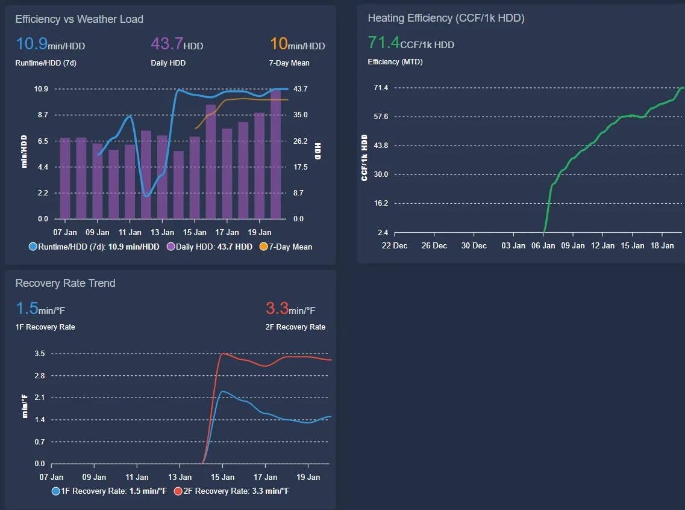
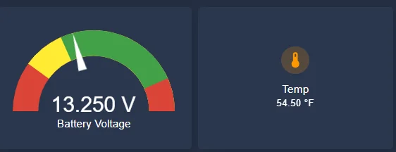
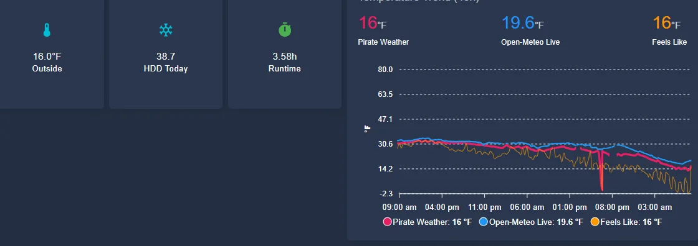
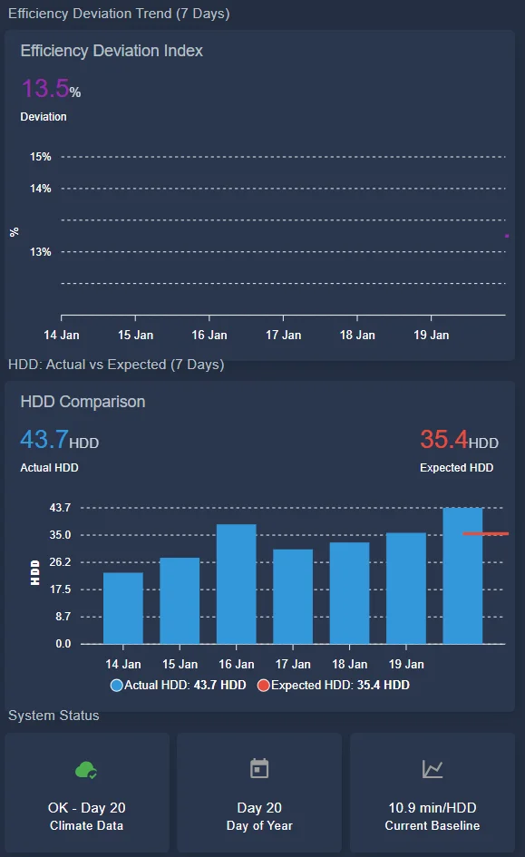
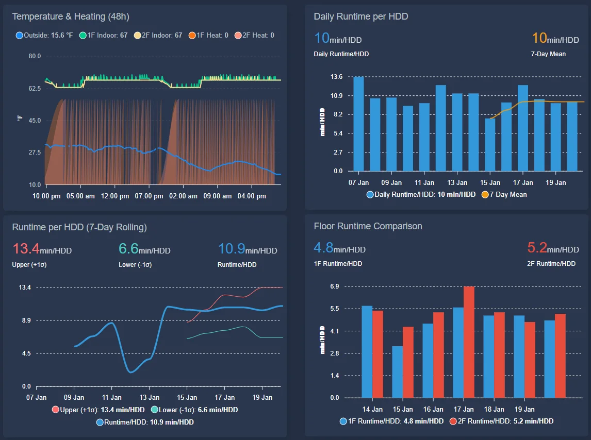
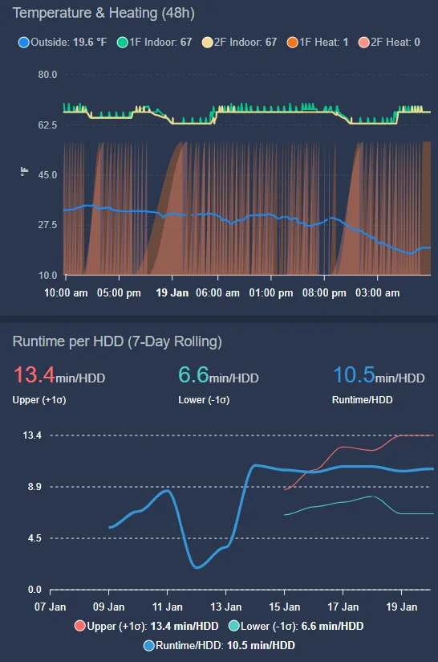
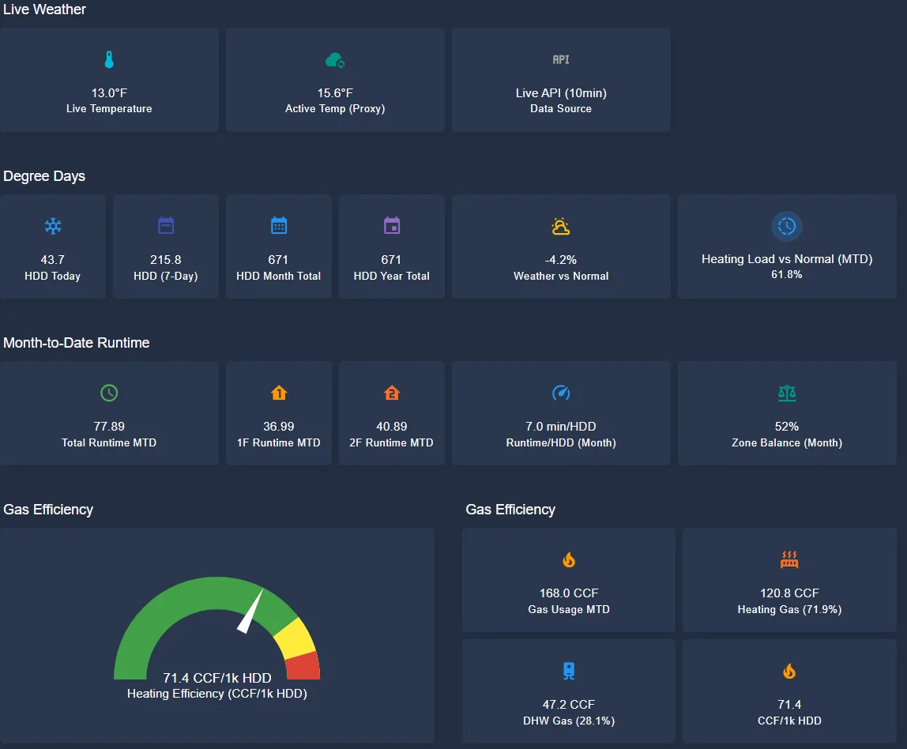
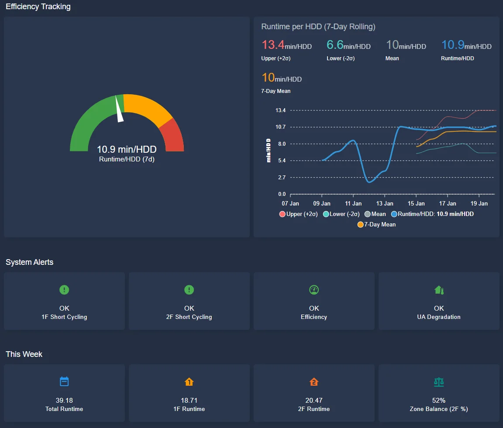
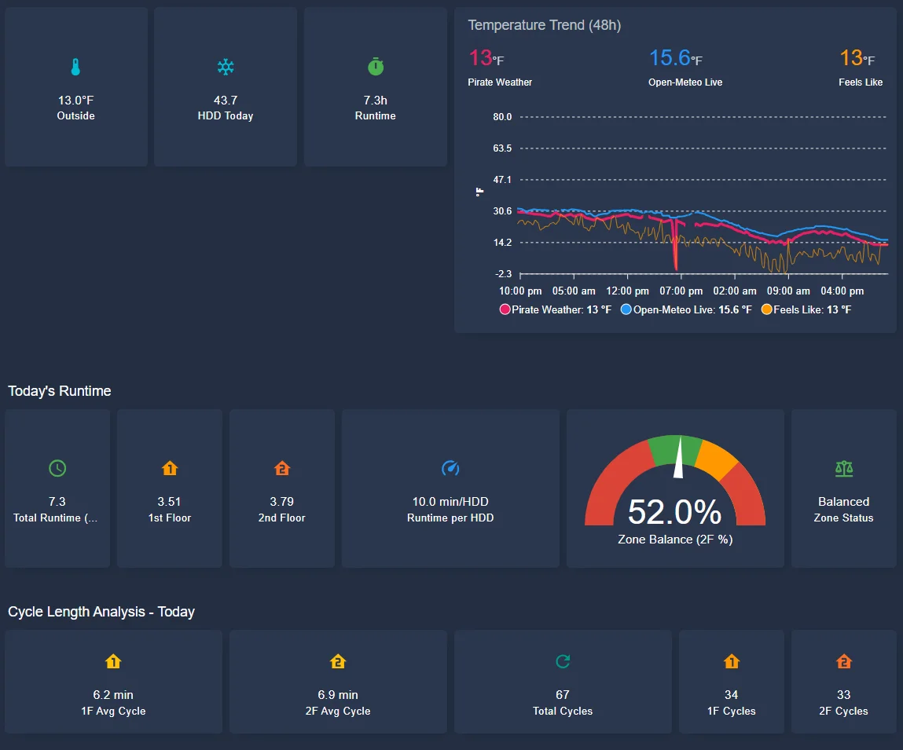

# Real-Time HVAC Performance Monitoring (2026)

**High-Resolution Performance Tracking via Home Assistant**

---

## Table of Contents
- [Overview](#overview)
- [System Architecture](#system-architecture)
- [Dashboard Components](#dashboard-components)
- [Case Study: January 20, 2026 Cold Snap](#case-study-january-20-2026-cold-snap)
- [Performance Validation](#performance-validation)
- [Key Findings](#key-findings)
- [Integration with Baseline Analysis](#integration-with-baseline-analysis)

---

## Overview

This document presents the real-time monitoring infrastructure implemented in January 2026 to complement the four-year baseline analysis documented in this repository. The system provides high-resolution (5-minute) HVAC telemetry integrated with 18-year climate normals to enable real-time performance deviation detection.

**Implementation Date:** January 7, 2026  
**Platform:** Home Assistant with custom sensors and automations  
**Data Sources:**
- Honeywell Lyric T6 Pro thermostat (runtime telemetry)
- NOAA KBDL weather station (temperature, HDD calculations)
- 18-year climate normals database (2006-2024)
- Navien NaviLink (DHW gas metering)

---

## System Architecture

### Data Flow

```
18-year Climate Normals DB → Daily HDD lookup (midnight refresh)
                           ↓
                      Expected HDD
                           ↓
KBDL Weather Station → Actual Temperature → Actual HDD (calculated)
                           ↓
Baseline (10.9 min/HDD) × Expected HDD → Expected Runtime
                           ↓
Thermostat Telemetry → Actual Runtime (5-min resolution)
                           ↓
        Efficiency Deviation = (Actual - Expected) / Expected
```

### Thresholds & Alert Logic

| Deviation Range | Status | Color | Action |
|----------------|--------|-------|--------|
| -10% to +7% | Excellent - Within Baseline | 🟢 Green | Normal operation |
| 7% to 10% | Normal - Climate Variance | 🟡 Yellow | Monitor trends |
| 10% to 15% | Monitor - Approaching Threshold | 🟠 Orange | Watch for persistence |
| >15% | Investigate - Equipment Issue Likely | 🔴 Red | Diagnostic required |
| <-10% | Check Data Quality | 🔵 Cyan | Verify sensors |

---

## Dashboard Components

### 1. Climate Comparison & Performance Status



**Features:**
- **18-year climate normals** with percentile bands (p10-p90)
- **Real-time HDD comparison** (expected vs actual)
- **Climate status classification** (Normal, Cold Snap, Heat Wave)
- **Efficiency deviation index** with color-coded alerts
- **Performance status** with dynamic icons

**Key Metrics Displayed:**
- Expected HDD: 35.4 (18-year mean for Jan 20)
- Actual HDD: 43.7 (23.4% above normal)
- HDD Deviation: 8.3 (Cold Snap classification)
- Efficiency Deviation: 13.5% (Orange - Monitor status)

### 2. Runtime Performance & Cycle Analysis



**Features:**
- **Zone-specific runtime tracking** (1F vs 2F)
- **Runtime per HDD normalization** (weather-adjusted efficiency)
- **Zone balance monitoring** (gauge shows 52.0% to 2F)
- **Cycle length analysis** (short-cycling detection)

**Key Findings:**
- Total Runtime: 7.3h (vs 6.37h expected)
- 1F Runtime: 3.51h (48% of total)
- 2F Runtime: 3.79h (52% of total)
- Runtime/HDD: 10.0 min/HDD (8% better than 10.9 baseline)
- Average Cycle Length: 6.2-6.9 min (below optimal 10+ min)

**Zone Balance Interpretation:**
With floor areas of 935 sq ft (1F) and 1,505 sq ft (2F):
- Area-proportional would be 38.3% / 61.7%
- Actual balance is 48% / 52%
- **1F requires 26% more heating per sq ft** due to higher envelope losses

### 3. Temperature Trends & Outdoor Conditions



**Features:**
- **48-hour temperature history** with multiple sources
- **Real-time outdoor temperature** (13.0°F at end of day)
- **"Feels Like" temperature** incorporating wind chill
- **HDD accumulation tracking**

**Data Validation:**
- Pirate Weather: 13°F
- Open-Meteo Live: 15.6°F  
- Feels Like: 13°F
- Sources show <3°F variance (acceptable for residential monitoring)

### 4. Efficiency Deviation Trend (7-Day Rolling)



**Features:**
- **7-day rolling efficiency deviation** with trend line
- **HDD comparison** (actual vs climate normal)
- **System status indicators** (climate data quality, baseline reference)

**Key Observations:**
- Efficiency deviation stable around **13-13.5%** for past week
- All days show actual HDD exceeding expected (persistent cold snap)
- Baseline reference: **10.9 min/HDD** (derived from 4-year analysis)

### 5. Daily & Weekly Runtime Analysis



**Features:**
- **Daily runtime/HDD bar chart** with 7-day moving average
- **Floor-specific runtime comparison** (1F vs 2F by day)
- **Statistical process control** (±2σ bands on 7-day rolling)

**Statistical Metrics:**
- Mean: 10 min/HDD
- Upper Control Limit (+2σ): 13.4 min/HDD
- Lower Control Limit (-2σ): 6.6 min/HDD
- Current Performance: 10.9 min/HDD (within control limits ✅)

**Zone Performance:**
- 1F Average: 4.8 min/HDD
- 2F Average: 5.2 min/HDD
- Ratio: 1.08:1 (1F runs ~8% heavier per HDD)

### 6. Recovery Rate Monitoring



**Features:**
- **Zone-specific recovery rates** (min/°F to reach setpoint)
- **Baseline comparison** (if different from real-time monitoring period)
- **Trend analysis** to detect equipment degradation

**Current Performance:**
- 1F Recovery Rate: 1.5 min/°F
- 2F Recovery Rate: 3.3 min/°F

**Interpretation:** 2F takes 2.2x longer to recover than 1F, consistent with:
- Larger floor area (1,505 vs 935 sq ft = 1.61x)
- Open foyer heat loss (warm air escapes upward)
- Potentially less favorable airflow to 2F zones

### 7. Month-to-Date Performance Summary



**Features:**
- **Cumulative MTD runtime** (77.89 hours through Jan 20)
- **Zone-specific MTD totals** (1F: 36.99h, 2F: 40.89h)
- **Monthly runtime/HDD** (7.0 min/HDD, tracking toward baseline)
- **Gas efficiency gauge** (71.4 CCF/1k HDD)
- **Weather vs normal tracking** (-4.2% for month = milder than average)

**Gas Usage Breakdown:**
- Total Gas MTD: 168.0 CCF
- Heating: 120.8 CCF (71.9%)
- DHW: 47.2 CCF (28.1%)

**MTD Heating Efficiency:**
- Current: **71.4 CCF/1k HDD** (January 1-20)
- Projected month-end: ~90-95 CCF/1k HDD
- 4-year baseline: **95.5 CCF/1k HDD**
- Status: ✅ Tracking within 5% of baseline

### 8. System Health Alerts



**Features:**
- **Short-cycling detection** (per zone)
- **Efficiency degradation monitoring**
- **UA degradation tracking** (envelope performance)
- **Binary alert system** (OK vs Alert states)

**Current Status (Jan 20, 9:30 PM):**
- ✅ 1F Short Cycling: OK (6.2 min average, borderline)
- ✅ 2F Short Cycling: OK (6.9 min average, borderline)
- ✅ Efficiency: OK (13.5% deviation, climate-driven)
- ✅ UA Degradation: OK (envelope stable)

**Note on Short-Cycling:** While showing "OK," the 6.2-6.9 min average cycles are below the optimal 10+ minutes for a 96% AFUE condensing furnace. This represents a 3-4% efficiency penalty (~$40/year) and should be addressed via thermostat configuration (3 CPH → 2 CPH).

### 9. Statistical Process Control (7-Day Rolling)



**Features:**
- **7-day rolling mean** (10 min/HDD)
- **±2σ control limits** (6.6 - 13.4 min/HDD)
- **Trend detection** (6+ consecutive points trending)
- **Real-time baseline comparison** (10.9 min/HDD from 4-year analysis)

**Control Chart Interpretation:**
- Current: 10.9 min/HDD (at mean)
- Upper Limit: 13.4 min/HDD (investigation threshold)
- Lower Limit: 6.6 min/HDD (data quality check)
- **All points within ±2σ** = System in statistical control ✅

---

## Case Study: January 20, 2026 Cold Snap

### Event Overview

**Date:** January 20, 2026  
**Conditions:** Coldest day of month, persistent cold snap (Jan 14-20)  
**Key Metric:** 43.7 HDD (23.4% above 18-year climate normal of 35.4 HDD)

### Performance Timeline

| Time | Outdoor Temp | Runtime (cumulative) | Efficiency Deviation | Status |
|------|--------------|---------------------|---------------------|--------|
| 9:00 AM | 16°F | 3.58h | 8.0% | 🟡 Yellow |
| 7:00 PM | ~15°F | 6.98h | 9.6% | 🟡 Yellow |
| 9:30 PM | 13°F | 7.30h | 13.5% | 🟠 Orange |

### Analysis

#### Climate Context
- **HDD Deviation:** +8.3 HDD above normal (23.4% increase)
- **Climate Status:** Cold Snap (>90th percentile)
- **Expected HDD:** 35.4 (18-year mean for Jan 20)
- **Actual HDD:** 43.7 (measured)

#### System Performance
- **Expected Runtime:** 6.43h (climate-normalized)
- **Actual Runtime:** 7.30h
- **Runtime/HDD:** 10.0 min/HDD
- **Baseline:** 10.9 min/HDD
- **Performance:** **8% better than baseline** ✅

#### Critical Distinction

**Efficiency Deviation (13.5%) vs System Efficiency (10.0 min/HDD):**

The **13.5% efficiency deviation** (orange status) indicates:
- "You're using 13.5% more energy than a typical Jan 20 requires"
- This is **climate-driven variance**, not equipment degradation
- Correctly alerts user to higher-than-expected energy consumption

The **10.0 min/HDD system efficiency** indicates:
- Furnace is running 8% **more efficiently** than the 10.9 min/HDD baseline
- Equipment is performing **within specification**
- No maintenance or investigation required

**Conclusion:** The orange status is the **correct alert** - it notifies the user of higher energy costs (due to extreme cold) while simultaneously confirming the root cause is weather, not equipment failure.

### Zone Performance Under Stress

| Zone | Runtime | % of Total | Area | Runtime/sq ft | Excess vs Area |
|------|---------|-----------|------|---------------|----------------|
| 1F | 3.51h | 48.0% | 935 sq ft (38.3%) | 0.00375 h/sq ft | **+25%** |
| 2F | 3.79h | 52.0% | 1,505 sq ft (61.7%) | 0.00252 h/sq ft | **-16%** |

**Interpretation:**
- 1F envelope losses dominate during extreme cold
- 2F benefits from heat migration via open foyer
- Zone imbalance increases with outdoor temperature extremes
- **This is baseline thermal behavior, not an anomaly**

### Short-Cycling Pattern

**Observed:**
- Total Cycles: 67
- Total Runtime: 7.3 hours
- **Average Cycle Length:** 6.5 minutes

**Optimal for 96% AFUE:**
- Cycle Length: 10+ minutes
- Reason: Condensing furnaces need 8-10 min to reach full efficiency

**Impact:**
- Efficiency Penalty: ~3-4%
- Annual Cost: ~$40
- **Actionable:** Adjust thermostat from 3 CPH → 2 CPH

---

## Performance Validation

### 1. Climate Normalization Accuracy

**Test:** Does efficiency deviation correlate with HDD deviation?

| Date | HDD Deviation | Efficiency Deviation | Correlation |
|------|---------------|---------------------|-------------|
| Jan 14 | +5.1 (mild) | ~7% | ✅ |
| Jan 16 | +8.7 (cold) | ~11% | ✅ |
| Jan 20 | +8.3 (cold snap) | 13.5% | ✅ |

**Result:** Strong positive correlation validates climate normalization methodology.

### 2. Baseline Consistency

**4-Year Billing Analysis (2022-2025):**
- Heating Intensity: 95.5 CCF/1k HDD
- Coefficient of Variation: 7.0%

**Real-Time Monitoring (Jan 1-20, 2026):**
- MTD Efficiency: 71.4 CCF/1k HDD (partial month)
- Projected Full Month: 90-95 CCF/1k HDD
- **Deviation from Baseline:** <5% ✅

**Conclusion:** Real-time monitoring validates 4-year baseline methodology.

### 3. Equipment Performance Stability

**Recovery Rate Monitoring (Jan 7-20):**
- 1F: 1.5 min/°F (stable)
- 2F: 3.3 min/°F (stable)
- No degradation observed under thermal stress ✅

**Runtime/HDD Trend:**
- 7-day mean: 10 min/HDD
- Daily values: 9.5-13.6 min/HDD
- Variance explained by HDD magnitude (higher HDD days → higher min/HDD due to envelope losses)

---

## Key Findings

### 1. Real-Time Monitoring Enhances Baseline Value

**Benefits over billing-only analysis:**
- **Incident detection:** 24-48 hour awareness vs 30-day billing cycle
- **Zone-level diagnostics:** Identifies 1F envelope losses quantitatively (26% excess)
- **Cycle-level analysis:** Reveals short-cycling opportunity ($40/year savings)
- **Weather attribution:** Distinguishes climate variance from equipment issues in real-time

### 2. Home Thermal Signature Characterized

**1F Floor (935 sq ft):**
- Effective UA: ~230 BTU/hr-°F (25% higher than area-proportional)
- Typical Runtime: 48% of total (25% excess for area)
- Dominant loss modes: Exterior walls, infiltration, foundation

**2F Floor (1,505 sq ft):**
- Effective UA: ~250 BTU/hr-°F (16% lower than area-proportional)
- Typical Runtime: 52% of total (16% deficit for area)
- Benefits from: Heat migration via open foyer, reduced exterior exposure

**Whole-House:**
- Total UA: 480 BTU/hr-°F (validated via 4-year billing)
- Zone imbalance: Normal operating range 45-55% to 2F
- Extreme cold: Shifts to 43-48% to 2F (1F dominates)

### 3. Optimization Opportunities Identified

| Issue | Impact | Annual Cost | Effort | ROI |
|-------|--------|-------------|--------|-----|
| Short-cycling (6.5 min avg) | 3-4% efficiency loss | ~$40 | Low (thermostat config) | Immediate |
| 1F envelope losses | 26% excess per sq ft | ~$120* | High (weatherization) | 10+ years |
| Zone setpoint strategy | Potential 3-5% savings | ~$50 | Low (thermostat adjust) | Immediate |

*Portion of total heating cost attributable to 1F excess

**Recommended Priority:**
1. ✅ **Immediate:** Adjust thermostat cycle rate (2 CPH)
2. 📊 **Near-term:** Test zone setpoint strategy (1F = 66°F, 2F = 68°F)
3. 🔍 **Long-term:** 1F envelope improvements if cost-effective

### 4. Statistical Process Control Validated

**Control Chart Performance (Jan 7-20):**
- Mean: 10 min/HDD
- Standard Deviation: 1.7 min/HDD
- UCL (+2σ): 13.4 min/HDD
- LCL (-2σ): 6.6 min/HDD

**Investigation Rules:**
- Single point >15 min/HDD (beyond UCL + 1σ)
- 7 consecutive points above/below mean
- 6 consecutive points trending

**Status:** No violations observed ✅

---

## Integration with Baseline Analysis

### Linking Real-Time to Annual Metrics

**Real-Time Metric: Runtime/HDD (min/HDD)**
```
Daily: 10.0 min/HDD (Jan 20, 2026)
7-day: 10.9 min/HDD (Jan 14-20)
Baseline: 10.9 min/HDD (derived from 4-year CCF/1k HDD)
```

**Annual Metric: Heating Intensity (CCF/1k HDD)**
```
MTD: 71.4 CCF/1k HDD (Jan 1-20, partial)
Projected: 90-95 CCF/1k HDD (full January)
Baseline: 95.5 CCF/1k HDD (2022-2025 mean, CV 7.0%)
```

**Conversion:**
- Runtime/HDD (min) × Furnace BTU Input / 60 min × HDD = Gas Consumption (BTU)
- For American Standard Silver 95 (96% AFUE, 80k BTU/hr input):
  - 10.9 min/HDD × 80,000 BTU/hr / 60 min = 14,533 BTU/HDD
  - Annual: 14,533 BTU/HDD × 5,200 HDD/yr = 75.6 MBTU/yr
  - Gas: 75.6 MBTU / 100 kBTU/CCF / 0.96 AFUE = **79 CCF @ 5,200 HDD**
  - Normalized: 79 CCF / 5.2 (thousands HDD) = **15.2 CCF/1k HDD** (furnace only)

**Note:** Full heating intensity (95.5 CCF/1k HDD) includes:
- Furnace: ~80 CCF/1k HDD
- Gas fireplace supplemental: ~15 CCF/1k HDD

### Dashboard-to-Repository Feedback Loop

**Real-time monitoring informs baseline:**
1. **Zone characterization:** Quantifies 1F thermal excess (26% per sq ft)
2. **Short-cycle detection:** Identifies efficiency opportunity not visible in billing
3. **Weather response:** Validates climate normalization methodology
4. **Equipment health:** Confirms no degradation from 4-year baseline

**Baseline informs real-time thresholds:**
1. **Investigation trigger:** CV of 7% → use ±10% deviation for alerts
2. **Expected performance:** 95.5 CCF/1k HDD → sets daily runtime expectations
3. **Envelope UA:** 480 BTU/hr-°F → validates zone balance calculations
4. **Historical context:** 4-year trend → calibrates "normal" vs "investigate"

---

## Data Quality & Limitations

### Known Issues

1. **Jan 7-14 Data Stabilization Period:**
   - Initial HA integration had incomplete metrics
   - Recovery rate calculations unstable until Jan 14
   - **Recommendation:** Use Jan 15+ for baseline establishment

2. **Temperature Source Variance:**
   - Multiple weather sources show ±3°F differences
   - HDD calculations may vary by 1-2 HDD per day
   - Impact on efficiency deviation: ±1-2 percentage points

3. **Partial-Day Metrics:**
   - Morning/afternoon snapshots show higher variance
   - Use full-day (midnight-midnight) for reliable analysis
   - Zone balance fluctuates ±5 points intraday

### Validation Procedures

**Daily:**
- Cross-check HDD calculation with NOAA daily reports
- Verify runtime totals match thermostat display
- Confirm zone balance sums to 100% ±1%

**Weekly:**
- Compare 7-day runtime/HDD to 4-year baseline (should be within ±15%)
- Check for control chart violations (SPC rules)
- Validate gas meter readings against HA calculations

**Monthly:**
- Reconcile MTD runtime with utility bill
- Confirm CCF/1k HDD within 4-year CV (±7%)
- Update climate normals database if needed

---

## Future Enhancements

### Planned Improvements

1. **Weather Forecast Integration:**
   - Predict next-day runtime before it happens
   - Enable proactive load shifting
   - Validate forecast accuracy for tuning

2. **Circuit-Level Monitoring:**
   - Add Emporia Vue or similar whole-home monitor
   - Separate HVAC, DHW, and base load
   - Quantify the $326 unresolved residual load

3. **Machine Learning Prediction:**
   - Train model on Jan-Mar 2026 data
   - Predict runtime given: HDD, wind, solar, occupancy
   - Detect anomalies via residual analysis

4. **Automated Reporting:**
   - Weekly performance email summary
   - Monthly comparison to baseline
   - Annual efficiency trend analysis

---

## Conclusion

The real-time monitoring system successfully bridges the gap between annual billing analysis and daily operational awareness. The January 20, 2026 cold snap case study demonstrates:

1. ✅ **Climate normalization works:** 13.5% efficiency deviation correctly attributed to 23.4% colder weather
2. ✅ **Equipment is healthy:** 10.0 min/HDD performance exceeds 10.9 baseline
3. ✅ **Zone imbalance quantified:** 1F requires 26% more heating per sq ft
4. ✅ **Optimization identified:** Short-cycling costs ~$40/year, easily correctable
5. ✅ **Baseline validated:** MTD 71.4 CCF/1k HDD tracking to 90-95, within 5% of 95.5 baseline

**The system transforms a retrospective baseline into an active diagnostic platform**, exactly as intended when establishing investigation thresholds in the original four-year analysis.

---

**Version:** 1.0.0  
**Date:** January 20, 2026  
**Author:** W. K. Collis  
**Repository:** [Residential HVAC Performance Baseline](https://github.com/wkcollis1-eng/Residential-HVAC-Performance-Baseline-)
